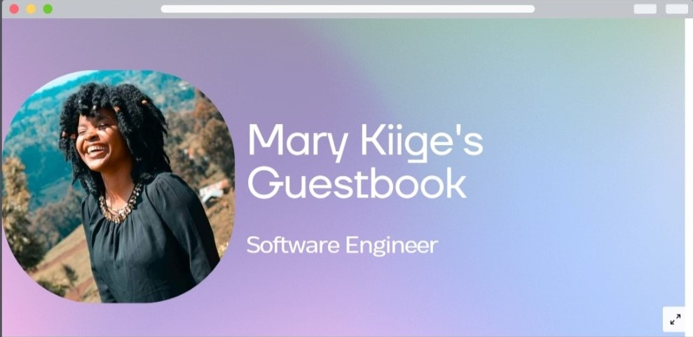
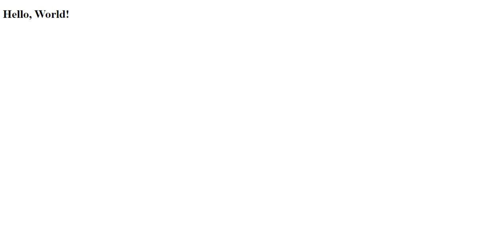
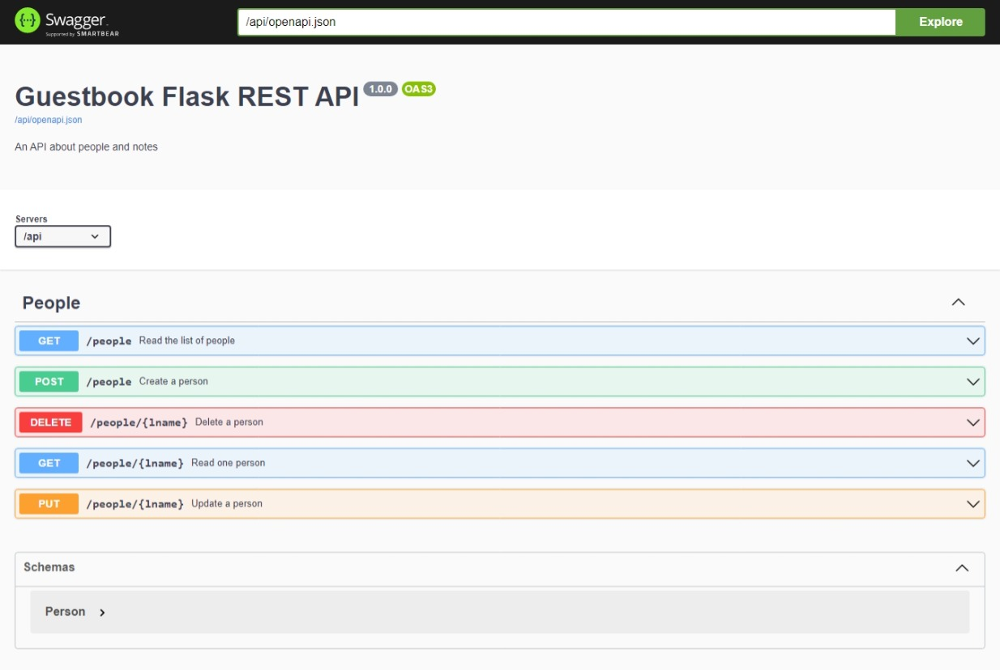
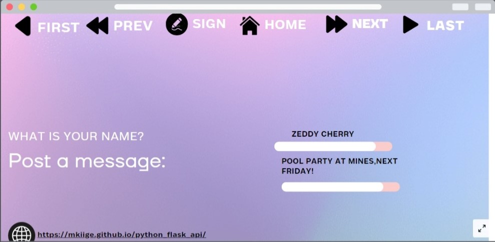
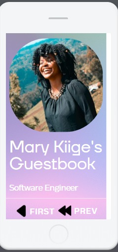
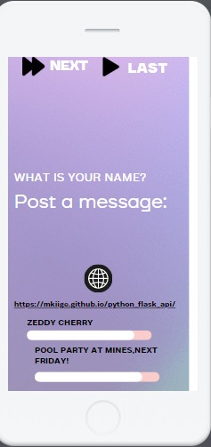

# Python REST APIs With Flask, Connexion, and SQLAlchemy 


 
 I chose to build my website to give an overview of how it should look.

This repository holds the code for Python REST APIs With Flask, Connexion, and SQLAlchemy.

First create a virtual environment:

```console
$ python -m venv venv
$ source venv/bin/activate
```

Install the pinned dependencies from `requirements.txt`:

```console
(venv) $ python -m pip install -r requirements.txt
```

Then, navigate into the `Guestbook_flask_api/` folder and start the development web server:

```console
(venv) $ cd Guestbook_flask_api
(venv) $ python app.py
```



To see your home page, visit `http://127.0.0.1:8000`. 

## Flask Starter

You can find the _Flask Starter_ files in the `flask_starter/` folder. 

To use the _Flask Starter_, copy the `flask_starter/` folder and rename it to your Flask project name. Open the terminal inside of your project folder, and create a virtual environment:

```console
$ python -m venv venv
$ source venv/bin/activate
```

You can then install Flask with `pip`:

```console
(venv) $ python -m pip install flask
```

You can start your Flask development server by running `app.py` as a script:

```console
(venv) $ python app.py
```

To see your home page, visit `http://127.0.0.1:8000`. You can find the Swagger UI API documentation on `http://127.0.0.1:8000/api/ui`.

#  Database Persistence

## Database Persistence

You should first create a virtual environment:

```console
$ python -m venv venv
$ source venv/bin/activate
```

Install the pinned dependencies from `requirements.txt`:

```console
(venv) $ python -m pip install -r requirements.txt
```

Then, navigate into the `Guestbook_flask_api/` folder:

```console
(venv) $ cd Guestbook_flask_api
(venv) $ python app.py
```


 My website on desktop.

### Optional: Build the Database

You can build a SQLite database with content by following the commands below.

Navigate inside the `Guestbook_flask_api/`, enter the Python interactive shell and run the commands below:

```pycon
>>> import sqlite3
>>> conn = sqlite3.connect("people.db")
>>> columns = [
...     "id INTEGER PRIMARY KEY",
...     "lname VARCHAR UNIQUE",
...     "fname VARCHAR",
...     "timestamp DATETIME",
... ]
>>> create_table_cmd = f"CREATE TABLE person ({','.join(columns)})"
>>> conn.execute(create_table_cmd)
>>> people = [
...     "1, 'Fairy', 'Sugar', '2022-10-08 09:15:10'",
...     "2, 'Ruprecht', 'Knecht', '2022-10-08 09:15:13'",
...     "3, 'Bunny', 'Easter', '2022-10-08 09:15:27'",
... ]
>>> for person_data in people:
...     insert_cmd = f"INSERT INTO person VALUES ({person_data})"
...     conn.execute(insert_cmd)
...
<sqlite3.Cursor object at 0x104ac4dc0>
<sqlite3.Cursor object at 0x104ac4f40>
<sqlite3.Cursor object at 0x104ac4fc0>

>>> conn.commit()
```

This will create a database named `people.db` that you can use with your project.

#  Database relation

## Database relation

You should first create a virtual environment:

```console
$ python -m venv venv
$ source venv/bin/activate
```

Install the pinned dependencies from `requirements.txt`:

```console
(venv) $ python -m pip install -r requirements.txt
```

Then, navigate into the `Guestbook/` folder:

```console
(venv) $ cd Guestbook_flask_api
(venv) $ python app.py
```

My website on mobile.

### Optional: Build the Database

You can build a SQLite database with content by following the commands below.

Navigate into the `Guestbook_flask_api/` folder:

```console
(venv) $ python build_database.py
```

This will delete any existing database and create a new database named `people.db` that you can use with your project.



My website on mobile.

## Author

- **Mary Kiige**, E-mail: [mkiige77@gmail.com]

## License

Distributed under the MIT license. See [`LICENSE`](../LICENSE) for more information.
